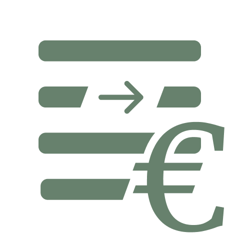

<p align="center">

<div>
<h1 align="center">Buachhoitung</h1>
A small progressive web app (PWA) built with <a href="https://nextjs.org/">Next.js</a> for keeping track of spendings.
</div>
</p>

## Description

> What is `Buachhoitung` for and what does the name mean?

I designed this app specifically for one person - my dad - who needs to keep track of his cash spendings.
The app is used to aid in his double-entry accounting workflow by allowing him to reflect his accounts in the app and add transactions which he can then export in his preferred format to incorporate in his Excel sheet.

The word `Buachhoitung` is dialect for the german word _Buchhaltung_ which means _bookkeeping_.

## Using Buachhoitung

### Setup

You can use `Buachhoitung` yourself by going to [buachhoitung.vercel.app](https://buachhoitung.vercel.app).
If you want to take advantage of the PWA capabilities, make sure you visit the website for a second time and then install it on your device.
Most browsers will offer this to you in the address bar or in your settings (`iOS`-devices offer the option _add to home screen_).

The app comes with a default account and an example transaction.
Feel free to delete or edit them and add your own.

### Accounts

I recommend you first add some accounts before anything else.
Navigate to the `transactions` page by clicking the  icon.
You can name your accounts and give them a description.
Of course, you can delete and edit any existing accounts.
Please beware however, that changing an existing account does not change any transactions involving the respective account (no cascading changes).

### Transactions

You can add transactions by clicking the  icon.
Enter the amount of the transaction and then choose the account from which the booking happens.
Once the first account is selected, it is highlighted in blue and you pick the account receiving the chosen amount.
Finally you can add a note and a transaction date.
If you want to cancel adding a transaction, simply click the `reload`-icon next to the heading or navigate to any other page.

When you click the  icon you will be taken to the `transactions` page where you can edit, delete or search for any existing transaction.
You can also cycle through the `date` and `sync` options to filter and sort all existing transactions.
In order to export transactions, click the icon next to the heading.
If using on a browser that does not support the `Web Share API` (such as all desktop browsers), you can specify an email address and the export will be an `.eml` file which will be downloaded and can be opened with most email apps.
When using most mobile browsers, the email function will however give you the option to use any other app for sharing.

Alternatively, you can copy all transactions to your clipboard or export them as csv.

When using the clipboard or email options, you can use <kbd>Cmd</kbd>+<kbd>Option</kbd>+<kbd>v</kbd> (or <kbd>Ctrl</kbd>+<kbd>Shift</kbd>+<kbd>v</kbd> on Windows) to paste as Unicode text in order to keep the tabs which are interpreted as column separators by Excel.

You can choose to export all transactions or only those that have not been synced yet.
I intentionally differentiate between synced and exported transactions as not all exported transactions are necessarily reflected in the actual bookkeeping system.
Hence, it is the user's responsibility to mark transactions as synced after exporting them.
All existing transactions can be marked as synced in the export menu.
After syncing, all synced transactions can be deleted at once from the export menu.

Please beware that the entirety of your data is stored on your device locally, meaning nothing will be sent to an external server.
This means that if you lose your device, your data is gone as well.

## Development

This PWA uses [Next.js](https://nextjs.org/) with `next-pwa`.
For storage, it relies on the `IndexedDB API`, meaning that all data is stored locally on the user's device.

I specifically designed the app to run on an iPhone 7 using enlarged text as this is what my dad uses.
Frankly, I do not expect the app to be used on desktop browsers - or any other devices actually as it caters to a very specific use case in my eyes.
Hence I did not bother making the app (or rather website) as responsive as I could have.

If you want to develop the app yourself, simply run the development server:

```bash
npm run dev
# or
yarn dev
# or
pnpm dev
```

For some reason, I consistently got errors when using the `next`-commands such as `next dev`.
Please refer to the [Next.js Documentation](https://nextjs.org/docs) for any further infos regarding development with `Next.js`.

As you have probably figured, I use vercel to deploy this website, which I can highly recommend.

I don't expect to put much effort into maintaining this projects though I am aware that there are several improvements to be made.

## Limitations

When using `Buachhoitung`, please beware that even though I set it up to be an installable PWA using only the user's local storage through the `IndexedDB API`, an internet connection is required to use the service as I did not bother caching the site.

Furthermore, I am aware that certain UI elements - especially regarding the `transactions` page could be improved.
As I already mentioned, I designed this specifically to be used on an iPhone 7 with enlarged text, which is why the app might look slightly off on larger devices and definitely weird on non-mobile devices.
Moreover, the format in which transactions are exported can not be changed in the UI, as I only implemented the format used by my dad.
Also, I did not bother translating the app from German to any other language as I do not expect it to have many users.

Frankly, I did not spend an extensive amount of time on testing the app, so use at your own discretion.
